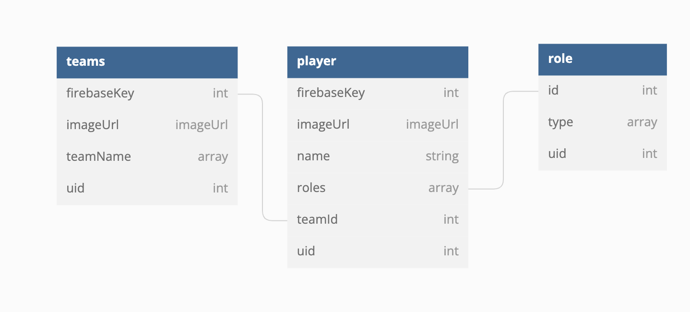

# ROOST
## Topics
- [Primary Features](#primary-features)
- [Target Audience](#target-audience)
- [Purpose](#purpose)
- [Getting Started](#getting-started)
- [Contributions](#contributions)
- [ERDs](#ERDs)
- [Loom Presentation](#loom-presentation)
___
## Primary Features
The primary features of this product allow the user to:
Create (and edit and delete) teams and, within those teams, cards featuring relevant information of team members, Edit the information on the individual cards, Delete the individual cards, Search for team members by name or role, Ensured privacy, as users are only able to see the team member cards that they created with their account.

## Target Audience
The target audience for this app is anyone who is on a team or part of a group of people who would find it helpful to store information in one place for team members.

## Purpose
The purpose of this app is to store data on members of a team or group in one place in an organized fashion. The information on each team member includes: Photo, Name, Phone, Email, Role(s), Additional Notes.

## Getting Started
In order to test the app, pull it down to your local machine and npm run dev to start the application on your browser. You can then sign in with google authorization and begin adding teams and team members. They are both tracked by users' userID, which means you can only see the cards of team members that you have personally created. 

## Contributions
This app was created by Kristen Chandler
https://github.com/kmchandler

## ERD

        
## Loom Video Walkthrough
